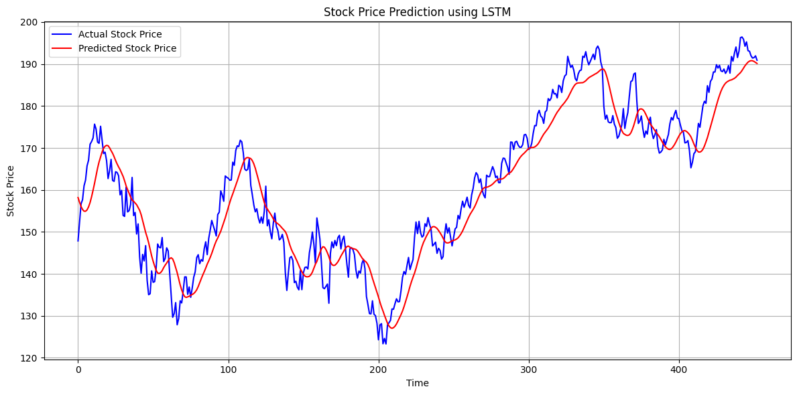

# 📈 Stock Price Prediction using LSTM

## 🎯 Objective
This project predicts future stock prices using an LSTM neural network trained on historical price data from Yahoo Finance.

---

## 🧰 Tools & Libraries
- Python
- Pandas, NumPy, Matplotlib
- scikit-learn
- Keras / TensorFlow
- Yahoo Finance API (`yfinance`)

---

## 🚀 Steps Implemented
1. **Fetch Data** – Collected stock price data for Apple (`AAPL`) using `yfinance`.
2. **Preprocessing** – Scaled prices using MinMaxScaler and created time-step sequences.
3. **Model Building** – Built a two-layer LSTM with 50 units each.
4. **Training & Validation** – Used 80% data for training, 20% for testing.
5. **Prediction & Visualization** – Compared predicted vs actual prices.
6. **Indicators (Optional)** – Added Moving Average and RSI for market insight.
7. **Deployment (Optional)** – Streamlit dashboard can be added for interactive predictions.

---

## 📊 Results
- LSTM captured the stock trend fairly well.
- Graph below shows actual vs predicted prices.



---

## 💾 How to Run
```bash
pip install yfinance keras tensorflow matplotlib pandas scikit-learn
python Stock_Price_Prediction_LSTM.py
